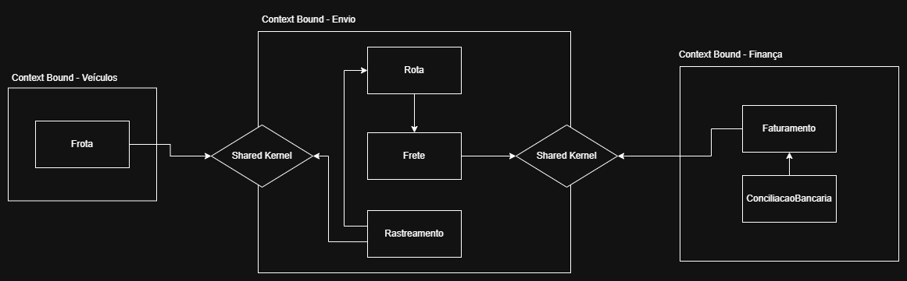

# Sistema de Gestão de Operadora Logística

Por que o DDD ajudará a empresa a organizar o ecossistema (conforme o projeto cresce): pois o DDD ajuda na separação de conceitos da organização, e facilita a comunicação. Isso deixa a estrutura mais modular, escalável, segura, simples e reduz o alto acoplamento entre as entidades.

### Domínios e Subdomínios:

* Rota - Core;
* Rastreamento - Core;
* Frete - Core;
* Faturamento - Generic;
* ConciliacaoBancaria - Generic;
* Frota - Supporting.

### Glossário (linguagem ubíqua):

| Termo | Explicação | Código |

* Frete -> taxa do envio : Frete
* Conciliação Bancária -> verificação de registros bancários : ConciliacaoBancaria
* Rota -> caminho traçado pelo veículo do pedido : Rota
* Rastreamento -> localização do envio : Rastreamento
* Faturamento -> informação da receita gerada: Faturamento
* Frota -> conjunto de veículos da organização : Frota
* Nota Fiscal -> registro de documento fiscal : NotaFiscal
* Tipo do Envio -> meio de transporte utilizado da rota : TipoEnvio

### Domínio | Diagrama DDD (strategic design):
(com bounded contexts e shared kernels).

Explicação das conexões no shared kernel: frete e faturamento compartilham funcionalidades relacionadas com as taxas das entregas. Frota e rastreamento compartilham informações relacionadas ao percurso de veículos da frota.   

A estrutura do projeto (com a divisão de domínios) está disponível dentro da pasta *estrutura* neste repositório.

